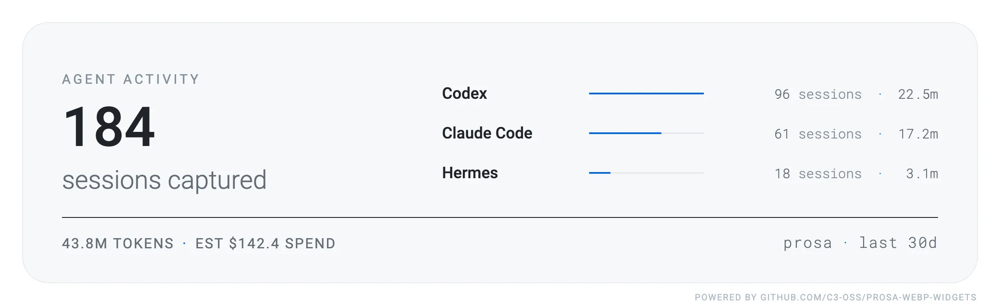
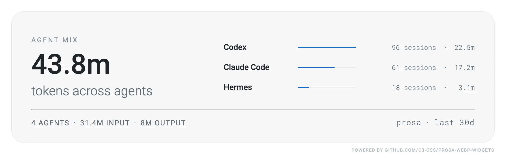
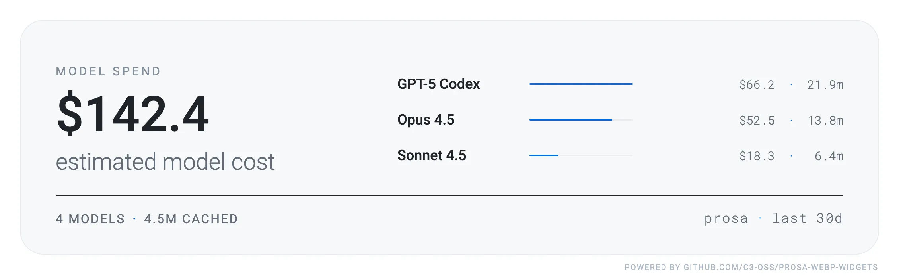
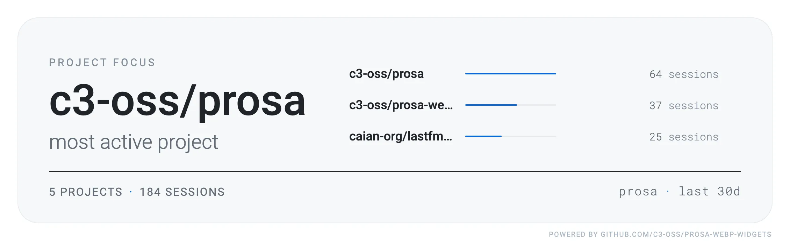
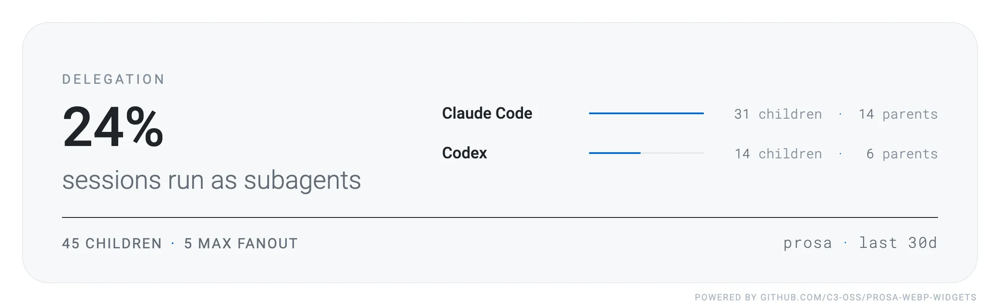

[![CI][ci-shield]][ci-url]
[![Release][rel-shield]][rel-url]
[![GitHub tag][tag-shield]][tag-url]

# `prosa-webp-widgets`

> theme-aware WebP cards for your GitHub profile, powered by prosa

[`prosa`][prosa] turns scattered Claude Code, Codex, Cursor, Gemini, and
Antigravity session histories into one local, searchable work log.
`prosa-webp-widgets` renders that work log as small, static **WebP cards** you
can drop into a GitHub profile README — five same-size widgets, each in a light
and a dark theme that switches automatically with the reader's color scheme.

It is, in spirit, [`lastfm-webp-widgets`][lastfm] for AI-agent usage analytics
instead of music: low information density, hierarchy carried by type and color,
no live server required to render.

## Widgets

Every card is a rounded, GitHub-themed panel with embedded Roboto, rendered at
`2260x696` from a `1130x348` logical layout (@2x). The previews below adapt to
your GitHub theme — light cards in light mode, dark cards in dark mode.

### Agent activity

Sessions captured in the window, the top agents by session count, and the
estimated total token spend.

<picture>
  <source media="(prefers-color-scheme: dark)" srcset=".github/assets/overview-dark.webp">
  
</picture>

### Agent mix

Total tokens across agents, split into input and output, with the leading
agents ranked by usage.

<picture>
  <source media="(prefers-color-scheme: dark)" srcset=".github/assets/agent-mix-dark.webp">
  
</picture>

### Model spend

Estimated model cost for the window, the number of models touched and cached
tokens, with the top models by spend.

<picture>
  <source media="(prefers-color-scheme: dark)" srcset=".github/assets/model-spend-dark.webp">
  
</picture>

### Project focus

The most active project and the runners-up by session count. Use
`--exclude-project` to keep private repositories out of the card.

<picture>
  <source media="(prefers-color-scheme: dark)" srcset=".github/assets/project-focus-dark.webp">
  
</picture>

### Delegation

Share of sessions run as subagents, the total child agents and max fan-out,
with the agents that delegate the most.

<picture>
  <source media="(prefers-color-scheme: dark)" srcset=".github/assets/delegation-dark.webp">
  
</picture>

## Quick start

Preview with mock data — deterministic, no prosa server needed:

```sh
just run render --mock --out ./out/mock
```

This writes all ten files (light and `-dark`) under `out/mock/`.

### Render from prosa

```sh
export PROSA_SERVER_URL='https://prosa.example.com'
export PROSA_APP_TOKEN='prosa_app_...'

just run render --last 30d --out ./out/prod
```

### Upload to S3

```sh
export S3_BUCKET_NAME='your-bucket'
export AWS_REGION='us-east-1'
export AWS_ACCESS_KEY_ID='...'
export AWS_SECRET_ACCESS_KEY='...'
export S3_PREFIX='prosa-widgets'
export S3_PUBLIC_BASE_URL='https://cdn.example.com'

just run render --last 30d --out ./out/prod --upload
```

Optional:

- `--exclude-project owner/repo` (repeatable or comma-separated) to hide
  projects from `project-focus`.
- `PROSA_HTTP_TIMEOUT` or `--timeout` to control the remote fetch timeout
  (default `30s`).
- `S3_ENDPOINT_URL` for S3-compatible storage.
- `S3_ACL` for buckets that still require a canned ACL.
- `CHROMIUM_BROWSER_BINARY_PATH` to use an existing Chrome/Chromium binary.

### Embed in a profile README

Point a `<picture>` at the uploaded light/dark pair so the card follows the
reader's theme:

```html
<picture>
  <source media="(prefers-color-scheme: dark)" srcset="https://cdn.example.com/overview-dark.webp">
  
</picture>
```

## Install

- **Prebuilt binaries** for linux/darwin × amd64/arm64 are attached to each
  [release][tag-url], alongside checksums and SBOMs.
- **Docker** images are published to the GitHub Container Registry as
  `ghcr.io/c3-oss/prosa-webp-widgets` (multi-arch).
- **From source** with [devbox][devbox] and [just][just] (see below).

## Development

```sh
devbox shell
just test
just build
```

`AGENTS.md` is the canonical guide — conventions, layout, recipes, hooks, and
what is intentionally not here.

## License

To the extent possible under law, [Caian Ertl][me] has waived __all copyright
and related or neighboring rights to this work__. In the spirit of _freedom of
information_, I encourage you to fork, modify, change, share, or do whatever
you like with this project! [`^C ^V`][kopimi]

[![License][cc-shield]][cc-url]

[prosa]: https://github.com/c3-oss/prosa
[lastfm]: https://github.com/caian-org/lastfm-webp-widgets
[devbox]: https://www.jetify.com/devbox
[just]: https://github.com/casey/just
[me]: https://github.com/upsetbit
[kopimi]: https://kopimi.com
[cc-shield]: https://forthebadge.com/images/badges/cc-0.svg
[cc-url]: http://creativecommons.org/publicdomain/zero/1.0

[ci-shield]: https://img.shields.io/github/actions/workflow/status/c3-oss/prosa-webp-widgets/ci.yml?label=ci&logo=github&style=flat-square
[ci-url]: https://github.com/c3-oss/prosa-webp-widgets/actions/workflows/ci.yml
[rel-shield]: https://img.shields.io/github/actions/workflow/status/c3-oss/prosa-webp-widgets/release.yml?label=release&logo=github&style=flat-square
[rel-url]: https://github.com/c3-oss/prosa-webp-widgets/actions/workflows/release.yml
[tag-shield]: https://img.shields.io/github/tag/c3-oss/prosa-webp-widgets.svg?logo=git&logoColor=FFF&style=flat-square
[tag-url]: https://github.com/c3-oss/prosa-webp-widgets/releases
